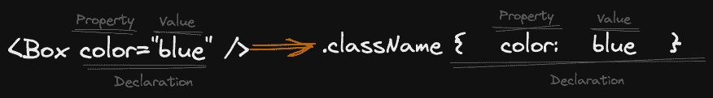

# S

S is a browser micro-library (<1 KB) to define CSS declarations as props and creates atomic classes from them.



## Key Features

- Micro-libraries (<1 KB)
- Framework agnostic
- CSS declarations as attributes
- Automatic creation of atomic CSS
- Small API, not much to learn

## Install

You can use pnpm, npm or yarn to install it.

```console
pnpm add github:fustak-dev/s
```

## How to use it

### Let's start

Using it is very simple, you just have to import the `s` function and use it as a prop.

```javascript
// Box.jsx
import { s } from '@fustak/s';

export function Box() {
    return <div { ...s({ background: 'blue' }) } />;
}
```

Output

```html
<div class="c2405978758" />
```

```html
<style id="@fustak/s">
    .c2405978758 {background: blue}
</style>
```

Preact Shim:

To use it with Preact you can create a shim file.

```javascript
// preact-shim.js
import { s } from '@fustak/s';
import { h, Fragment } from 'preact';

function u({ attributes, children, tag, defaultProps = {}, props = {}, ...rest }) {
    const newProps = { ...props, ...rest };
    return h(
        newProps.tag || tag,
        s({ attributes, props: { ...defaultProps, ...newProps } }),
        [].concat.apply([], typeof children === 'string' ? [children] : children)
    );
}

window.h = h;
window.Fragment = Fragment;
window.U = u;
window.u = u;
```

Import it in your `index.js` file.

```javascript
// index.js
import './preact-shim';

import { render } from 'preact';

import { App } from './App';

render(<App />, document.getElementById('root'));
```

```javascript
// App.jsx
import { Box } from './Box';

export function App() {
    return <Box />;
}
```

```javascript
// Box.jsx
export function Box() {
    return <U tag="div" background="blue" />;
}
```

Output

```html
<div class="c2405978758" />
```

```html
<style id="fustak-s">
    .c2405978758 {background: blue}
</style>
```

An example importing the html element attributes from the `@fustak/s/attrs` module.

```javascript
// Button.jsx
import { s } from '@fustak/s';
import { button } from '@fustak/s/attrs';

export function Button({ children, ...props }) {
    return <U
        tag='button'
        type='button'
        attributes={button}
        background='#1f2937'
        borderRadius='4px'
        color='#fff'
        padding='8px'
        style={{
            ':hover': {
                background: '#fff',
                color: '#1f2937',
            },
        }}
        { ...props }
    />;
}
```

```javascript
// App.jsx

import { Button } from './Button';

export function App() {
    return <Button>Button</Button>;
}
```

Output

```html
<button class="c2405978758 c2405978759 c2405978760 c2405978761 c2405978762 c2405978763">Button</button>
```

```html
<style id="@fustak/s">
    .c2405978758 {background-color: #1f2937}
    .c2405978759 {color: #fff}
    .c2405978760 {padding: 8px}
    .c2405978761 {border-radius: 4px}
    .c2405978762:hover {color: #1f2937}
    .c2405978763:hover {background: #fff}
</style>
```

## Acknowledgments

### Inspiration

-   [U](https://github.com/gc-victor/u)
-   [c-c](https://github.com/gc-victor/c-c)

### Tools

-   [esbuild](https://esbuild.github.io/)
-   [gzip-size](https://esbuild.github.io/)
-   [t-t](https://github.com/gc-victor/t-t)
-   [chokidar-cli](https://github.com/kimmobrunfeldt/chokidar-cli)

## Compatible Versioning

### Summary

Given a version number MAJOR.MINOR, increment the:

-   MAJOR version when you make backwards-incompatible updates of any kind
-   MINOR version when you make 100% backwards-compatible updates

Additional labels for pre-release and build metadata are available as extensions to the MAJOR.MINOR format.

[](https://github.com/staltz/comver)

## Contribute

First off, thanks for taking the time to contribute!
Now, take a moment to be sure your contributions make sense to everyone else.

### Reporting Issues

Found a problem? Want a new feature? First of all, see if your issue or idea has [already been reported](../../issues).
If it hasn't, just open a [new clear and descriptive issue](../../issues/new).

### Commit message conventions

A specification for adding human and machine readable meaning to commit messages.

-   [Conventional Commits](https://www.conventionalcommits.org/en/v1.0.0/)

### Submitting pull requests

Pull requests are the greatest contributions, so be sure they are focused in scope and do avoid unrelated commits.

- Fork it!
- Clone your fork
- Navigate to the newly cloned directory
- Create a new branch for the new feature
- Install the tools necessary for development
- Make your changes.
- Verify your change doesn't increase output size.
- Make sure your change doesn't break anything.
- Commit your changes
- Push to the branch
- Submit a pull request with full remarks documenting your changes.

## License

MIT License

Copyright (c) 2023 Víctor García

Permission is hereby granted, free of charge, to any person obtaining a copy
of this software and associated documentation files (the "Software"), to deal
in the Software without restriction, including without limitation the rights
to use, copy, modify, merge, publish, distribute, sublicense, and/or sell
copies of the Software, and to permit persons to whom the Software is
furnished to do so, subject to the following conditions:

The above copyright notice and this permission notice shall be included in all
copies or substantial portions of the Software.

THE SOFTWARE IS PROVIDED "AS IS", WITHOUT WARRANTY OF ANY KIND, EXPRESS OR
IMPLIED, INCLUDING BUT NOT LIMITED TO THE WARRANTIES OF MERCHANTABILITY,
FITNESS FOR A PARTICULAR PURPOSE AND NONINFRINGEMENT. IN NO EVENT SHALL THE
AUTHORS OR COPYRIGHT HOLDERS BE LIABLE FOR ANY CLAIM, DAMAGES OR OTHER
LIABILITY, WHETHER IN AN ACTION OF CONTRACT, TORT OR OTHERWISE, ARISING FROM,
OUT OF OR IN CONNECTION WITH THE SOFTWARE OR THE USE OR OTHER DEALINGS IN THE
SOFTWARE.
